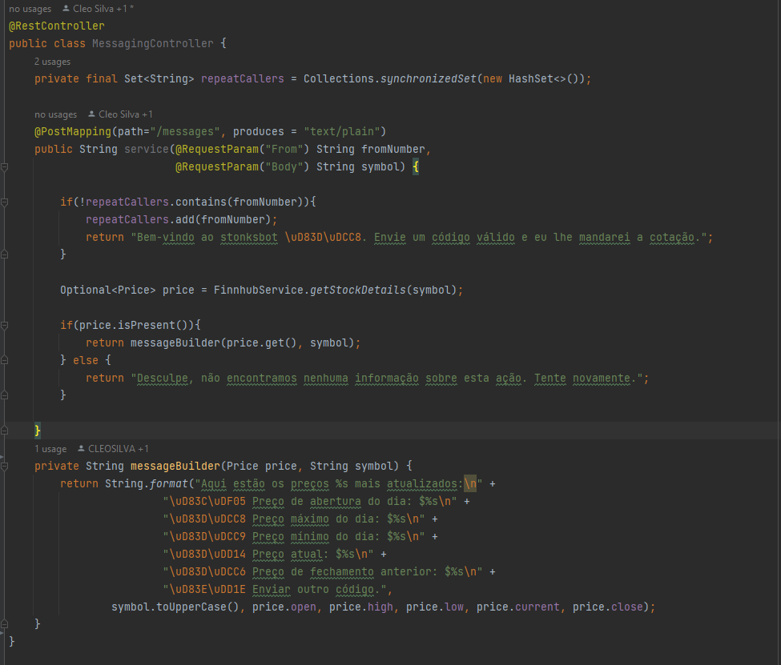
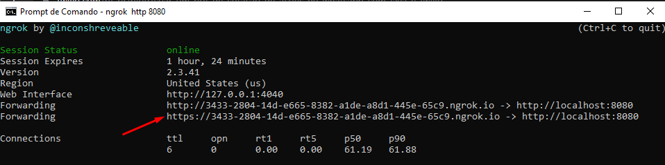
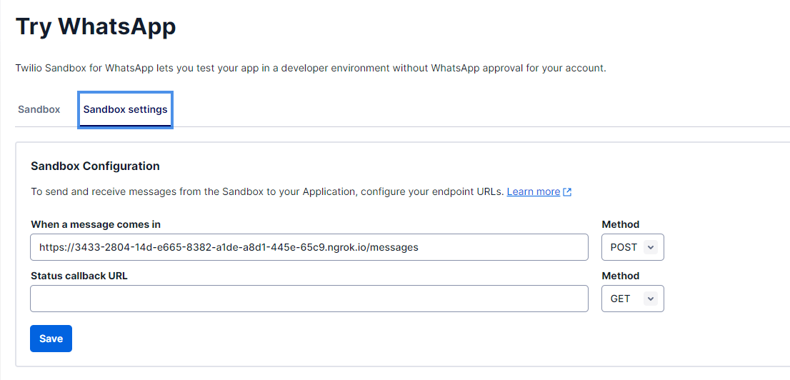
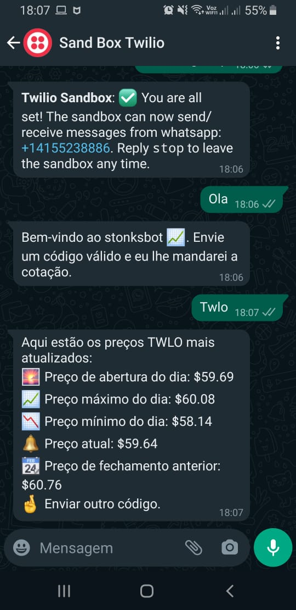

#  WhatsappBot
## Criando um Bot de cotação de ações no Whatsapp com Java e Twilio

### Pré-requisitos
* Uma conta Twilio. Cadastre-se gratuitamente [aqui](https://www.twilio.com/try-twilio?promo=QmCkRK)
* Java 8 ou superior (para ver uma instalação mais simples, confira o [SDKMAN!](https://www.twilio.com/blog/sdkman-work-with-multiple-versions-java))
* Chave API para a API da Finnhub.io. Registre-se gratuitamente para receber uma chave [aqui](https://finnhub.io/).
* ngrok - faça o download [aqui](https://ngrok.com/download).

### Configurando o projeto Java
Use o [Spring Initializr](https://start.spring.io/) para configurar seu projeto. Você vai precisar adicionar a dependência **Spring Web**.

### Criando um controlador para lidar com as mensagens

No src/main/java/com/whatsappstonksbot é criado uma classe chamada MessagingController. Onde lidamos com as mensagens enviadas para o whatsapp.



### Iniciando o ngrok para criar uma conexão
Em uma janela de terminal, navegue até onde o ngrok está instalado e execute o comando abaixo

```bash
ngrok http 8080 
```

Quando ele estiver em execução, deverá ter a seguinte aparência:

Copie o endereço **https://** e adicione **/messages** ao URL, pois esse é o nome do caminho do URL que você definiu no controlador.

### Configurando o SandBox Settings

Faça login na conta da Twilio e navegue até Messaging > Try it out > Send a Whatsapp message e copie o link da etapa anterior.



Agora, ao enviar uma mensagem para o sandbox do WhatsApp, você deverá ver o conteúdo abaixo. Se não funcionar, verifique 
se o servidor ainda está em execução, se o ngrok está configurado corretamente e em execução e se você tem o endpoint correto 
no sandbox (verifique https e se você tem o slug /messages).



